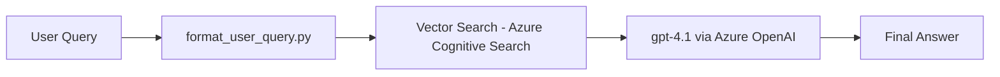

# RAG with Azure AI Foundry (and Azure AI Search)

This repository contains a **PromptFlow workflow** built in **Azure AI Foundry** that implements **RAG (Retrieval-Augmented Generation)** using:  
- **Azure OpenAI embeddings (`text-embedding-ada-002`)**  
- **Azure Cognitive Search** (vector + keyword retrieval)  
- **Azure OpenAI GPT (`gpt-4.1`)**  
- **Custom Python tool** for preprocessing queries  

### Author : SAIDA.D
---

## Overview

The flow performs:  
1. **Format Query** → A Python tool cleans and normalizes user input.  
2. **Vector Search** → Query is embedded and searched in an **Azure Cognitive Search index**.  
3. **LLM Call** → Retrieved documents + user query are passed to GPT for grounded answer generation.  
4. **Outputs** → Both the cleaned query and final answer are returned.  

---

## Inputs & Outputs

### Inputs
| Name        | Type   | Description |
|-------------|--------|-------------|
| `user_query` | string | User’s natural language query |

### Outputs
| Name            | Type   | Description |
|-----------------|--------|-------------|
| `response`      | string | Final generated answer from GPT |
| `python_response` | string | Cleaned query returned by the Python tool |

---

##### Flow


##### Search Index Args


## 📂 Project Structure

```
.
├── flow.dag.yaml           # PromptFlow workflow definition
├── format_user_query.py    # Custom Python tool to clean/normalize query
├── llm.jinja2              # Jinja2 template prompt for GPT
├── requirements.txt        # Python dependencies
└── README.md               # Documentation
```

---

## Components

### 🔹 1. `format_user_query` (Python Tool)
This is a **PromptFlow tool** implemented in Python.  
It strips whitespace and normalizes casing so queries are clean before embedding.

```python
from promptflow import tool


@tool
def format_user_query(user_query: str) -> str:
    """
    Clean and normalize user query.
    - Trim whitespace
    - Capitalize first letter
	- Works as tool where you can customize as per requirement
    """
    return user_query.strip().capitalize()
```

✅ Registered automatically in the flow via `flow.dag.yaml`.  

---

### 🔹 2. `query_index` (Vector Search)
- Uses `text-embedding-ada-002` (1536 dimensions).  
- Queries an **Azure Cognitive Search** index (`witty-arm-b6s85gxpks`).  
- Retrieves top-3 relevant documents.  

### 🔹 3. `llm` (LLM Node)
- Calls `gpt-4.1` (Azure OpenAI).  
- Uses retrieved context + formatted query for RAG-based response.  

---

## Running the Workflow

### 1. Clone Repository
```bash
git clone https://github.com/<your-org>/<your-repo>.git
cd <your-repo>
```

### 2. Install Dependencies
```bash
pip install -r requirements.txt
```

### 3. Configure Connections in Azure AI Foundry
- `reserch-agent-resource_aoai` → Azure OpenAI (for embeddings + GPT)  
- `aihubsearchindex` → Azure Cognitive Search (vector DB)  

### 4. Test Flow
```bash
pf flow test   --flow flow.dag.yaml   --inputs user_query="What are the benefits of RAG for document search?"
```

✅ Example Output:
```json
{
  "python_response": "What are the benefits of rag for document search?",
  "response": "Retrieval-Augmented Generation (RAG) improves accuracy by combining document search with GPT..."
}
```

---

## Workflow Architecture



---

## References
- [Azure AI Foundry](https://learn.microsoft.com/en-us/azure/ai-studio/)  
- [PromptFlow SDK](https://learn.microsoft.com/en-us/azure/ai-studio/concepts/prompt-flow)  
- [Azure Cognitive Search](https://learn.microsoft.com/en-us/azure/search/search-what-is-azure-search)  
- [Azure OpenAI Service](https://learn.microsoft.com/en-us/azure/cognitive-services/openai/)  

---

✨ This repo demonstrates how to build a **custom RAG pipeline in Azure AI Foundry** with **Python tools, embeddings, vector search, and GPT**.  
